# Sơ Đồ Kiến Trúc Hệ Thống KNS - Z-Mate Hub

## 1. ARCHITECTURE OVERVIEW (Tổng Quan Kiến Trúc)

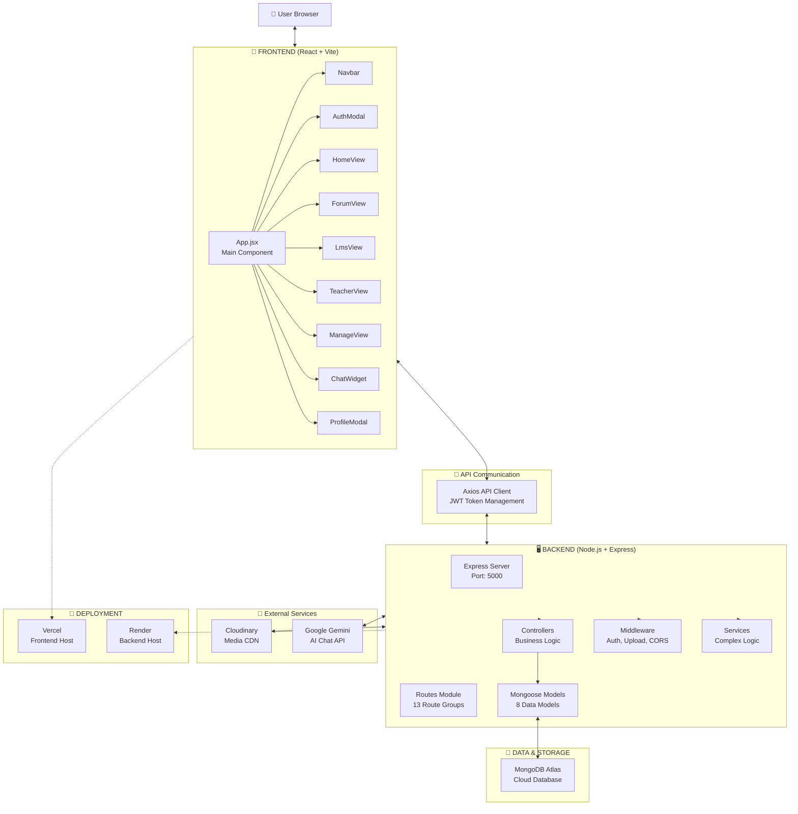

---

## 2. COMPONENT HIERARCHY (Phân Cấp Components)

```mermaid
graph TD
    App["<b>App.jsx</b><br/>State Manager"]
    
    App -->|activeTab=home| HomeView["<b>HomeView</b><br/>🏠 Trang chủ<br/>- Danh sách kỹ năng<br/>- Video default<br/>- HLS/DASH streaming"]
    
    App -->|activeTab=forum| ForumView["<b>ForumView</b><br/>💬 Diễn đàn<br/>- Tạo bài viết<br/>- Rich Text Editor<br/>- Bình luận<br/>- Phân trang 6 bài"]
    
    App -->|activeTab=lms| LmsView["<b>LmsView</b><br/>📚 Quản lý Khóa học<br/>- Danh sách courses<br/>- Đăng ký khóa học<br/>- Xem lessons<br/>- Video lesson"]
    
    App -->|activeTab=teacher| TeacherView["<b>TeacherView</b><br/>👨‍🏫 Bảng GV<br/>- Tạo khóa học<br/>- Quản lý lesson<br/>- Xem học viên<br/>- Upload video"]
    
    App -->|activeTab=manage| ManageView["<b>ManageView</b><br/>⚙️ Admin Dashboard<br/>- Quản lý users<br/>- Báo cáo vi phạm<br/>- Kiểm duyệt<br/>- System stats"]
    
    App -->|authMode| AuthModal["<b>AuthModal</b><br/>🔐 Xác thực<br/>- Login/Register<br/>- 3 vai trò<br/>- Token mgmt<br/>- localStorage"]
    
    App -->|profile| ProfileModal["<b>ProfileModal</b><br/>👤 Hồ sơ<br/>- Avatar<br/>- Bio<br/>- Stage name<br/>- Lịch sử điểm"]
    
    App -->|Chat| ChatWidget["<b>ChatWidget</b><br/>🤖 AI Chat<br/>- Gemini API<br/>- Kỹ năng gợi ý<br/>- Lịch sử<br/>- Floating widget"]
    
    App -->|Components| Navbar["<b>Navbar</b><br/>- Logo & Tagline<br/>- Nav links<br/>- User info<br/>- Rank & Points"]
    
    App -->|Components| Footer["<b>Footer</b><br/>- Copyright<br/>- Links"]
    
    App -->|Route| LessonFull["<b>LessonFullPage</b><br/>📖 Full Lesson<br/>- Nội dung<br/>- Video phát<br/>- Kiểm tra"]
```

---

## 3. DATA FLOW - AUTHENTICATION (Luồng Xác Thực)

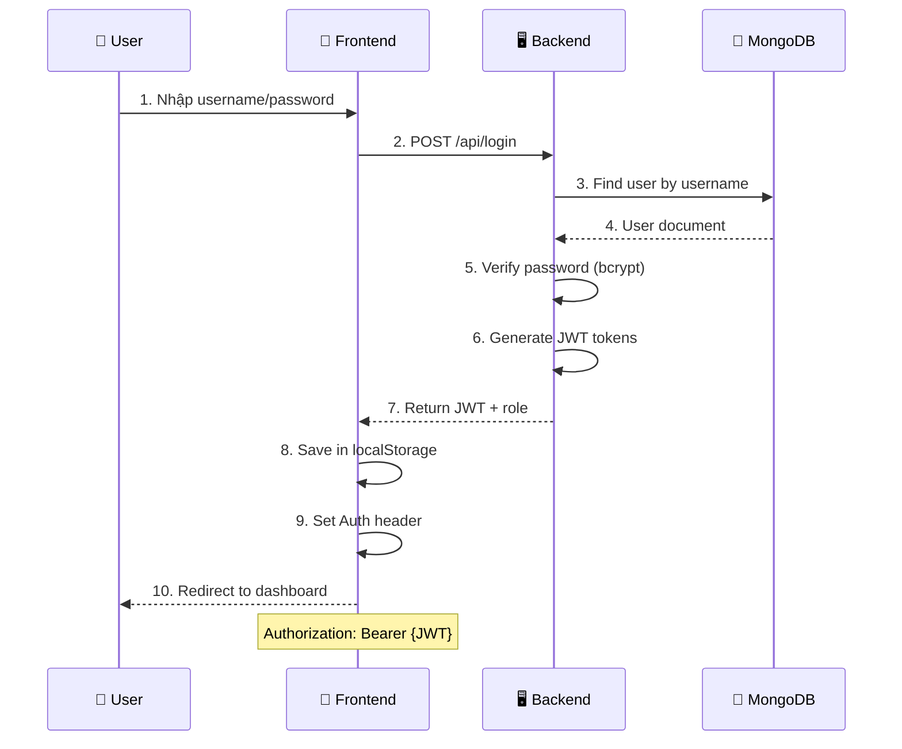

---

## 4. API ROUTES STRUCTURE (Cấu Trúc Routes)

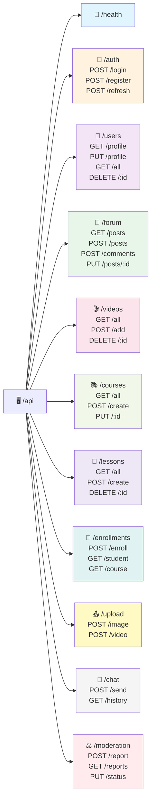

---

## 5. DATABASE SCHEMA (Sơ Đồ Cơ Sở Dữ Liệu)

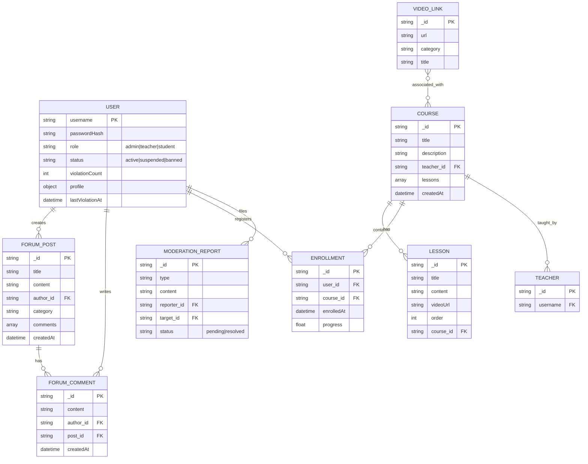

---

## 6. STATE MANAGEMENT (Quản Lý Trạng Thái)

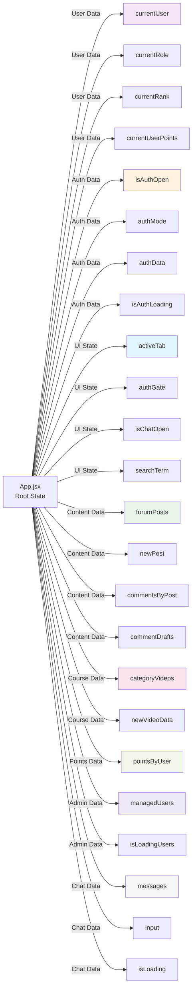

---

## 7. BACKEND CONTROLLER FLOW (Luồng Xử Lý Backend)

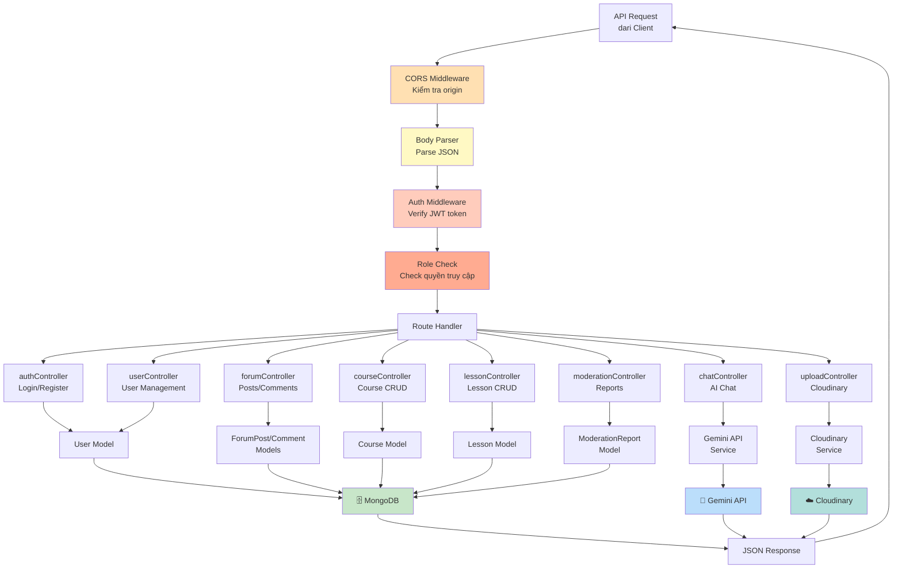

---

## 8. FORUM POST CREATION FLOW (Luồng Tạo Bài Viết Diễn Đàn)

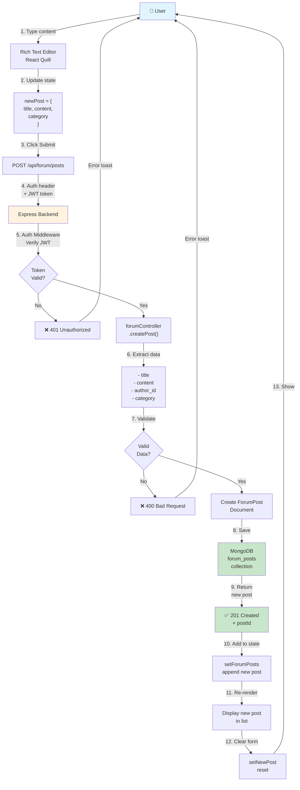

---

## 9. CHAT WITH AI FLOW (Luồng Chat AI)

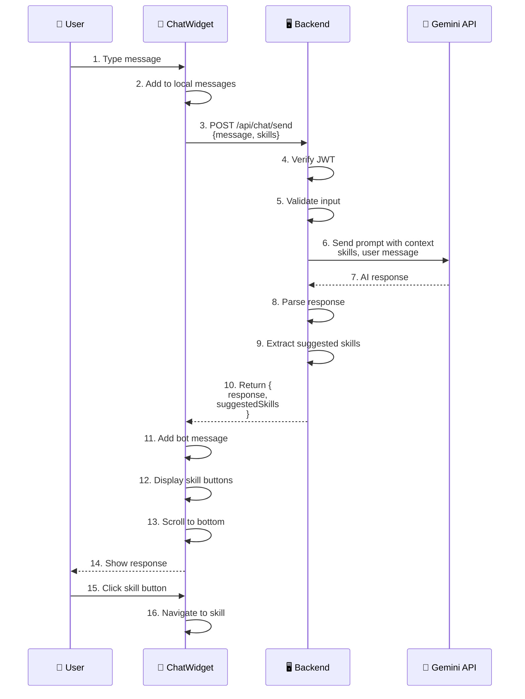

---

## 10. VIDEO STREAMING FLOW (Luồng Phát Video)

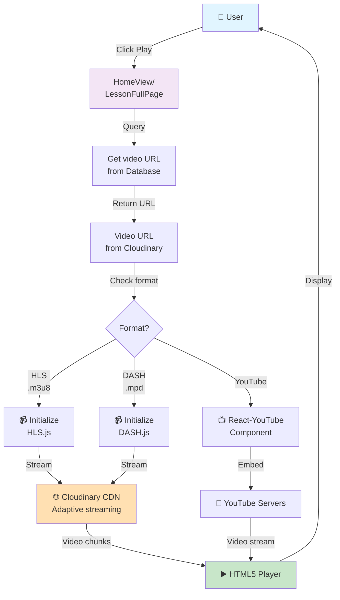

---

## 11. ROLE-BASED ACCESS CONTROL (RBAC)

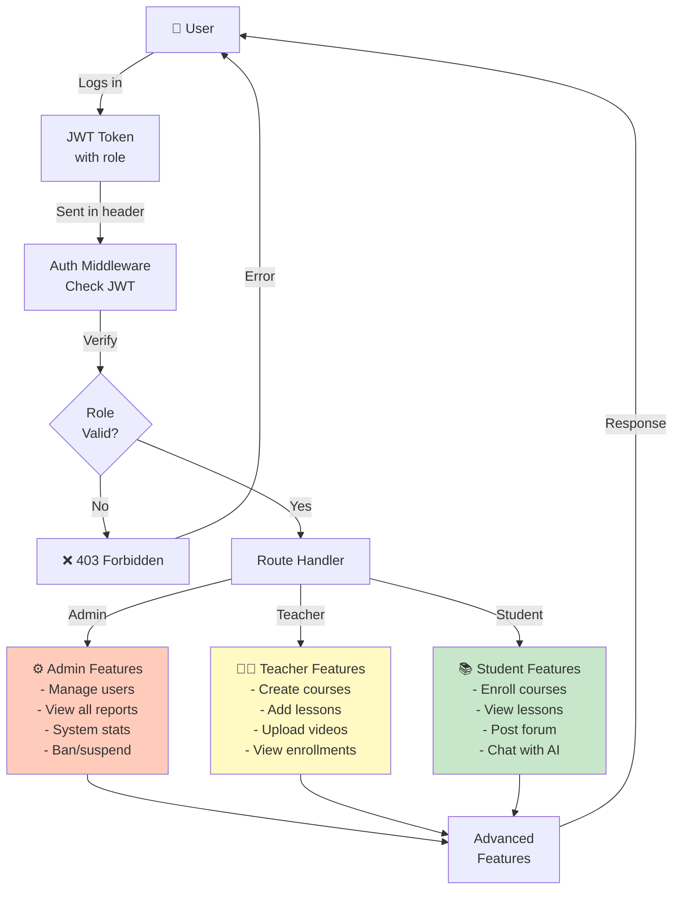

---

## 12. DEPLOYMENT ARCHITECTURE (Kiến Trúc Triển Khai)

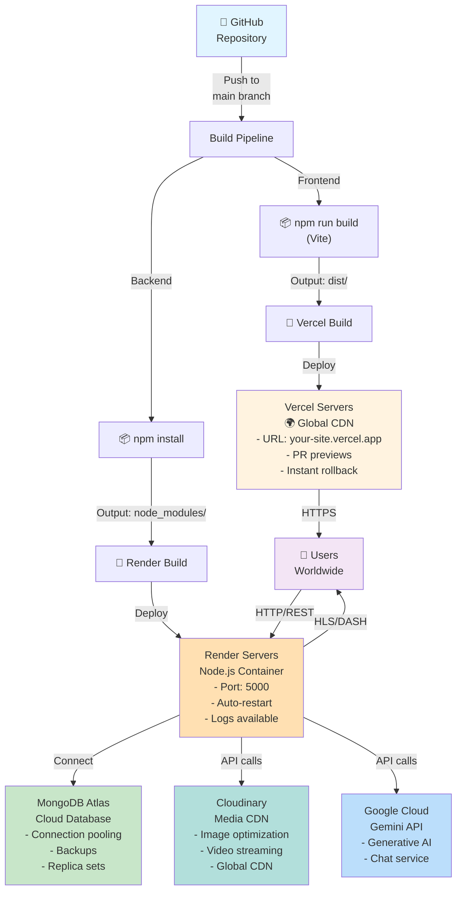

---

## 13. PERFORMANCE OPTIMIZATION (Tối Ưu Hiệu Suất)

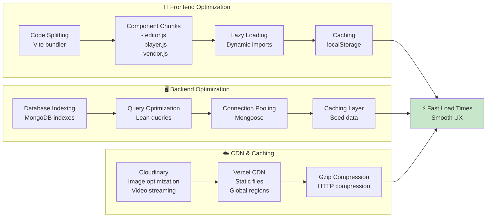

---

## 14. ERROR HANDLING & LOGGING (Xử Lý Lỗi & Ghi Log)

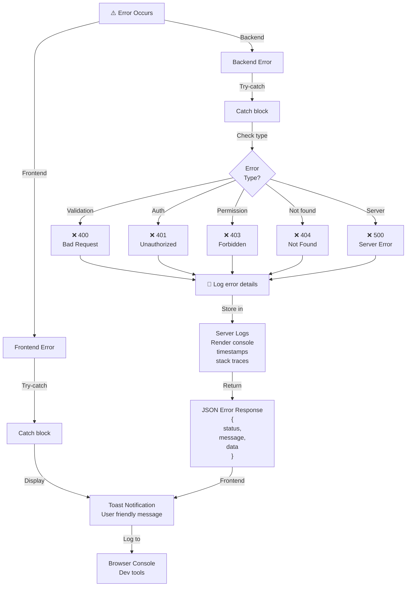

---

## 15. SECURITY LAYER (Lớp Bảo Mật)

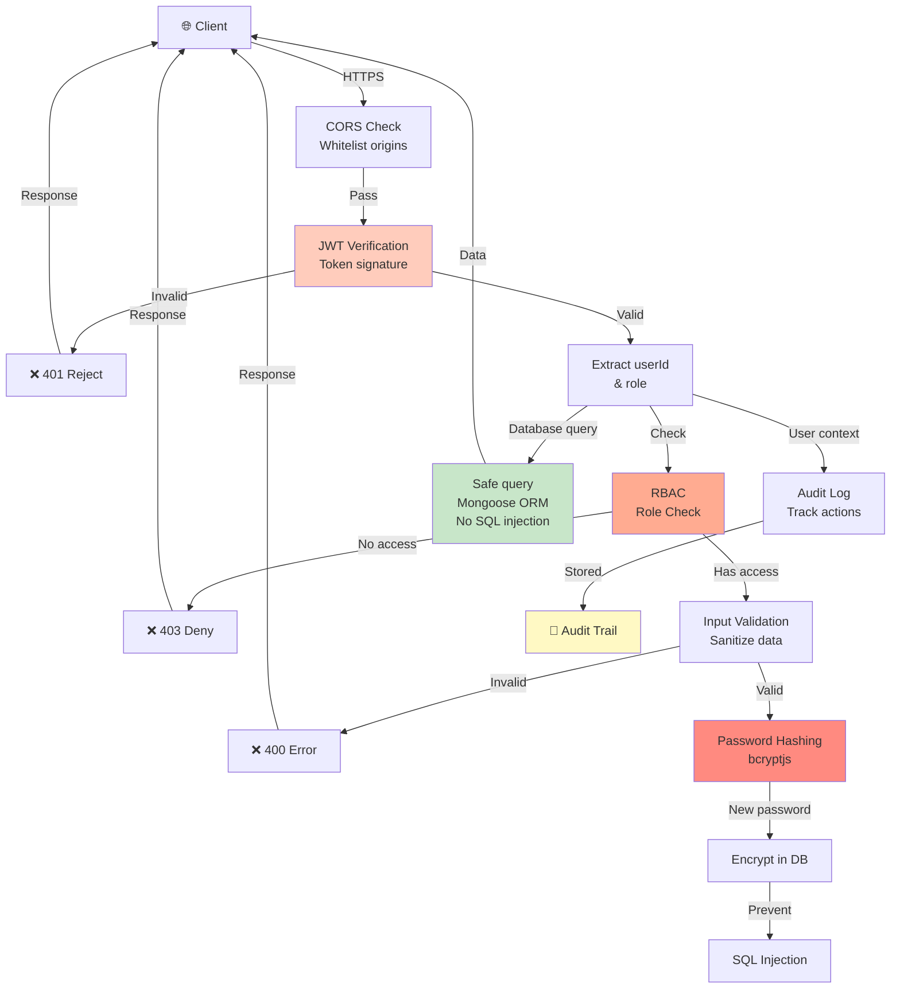

---

Các sơ đồ này trực quan hóa toàn bộ kiến trúc hệ thống KNS - Z-Mate Hub, từ giao diện người dùng cho đến triển khai trên server.
