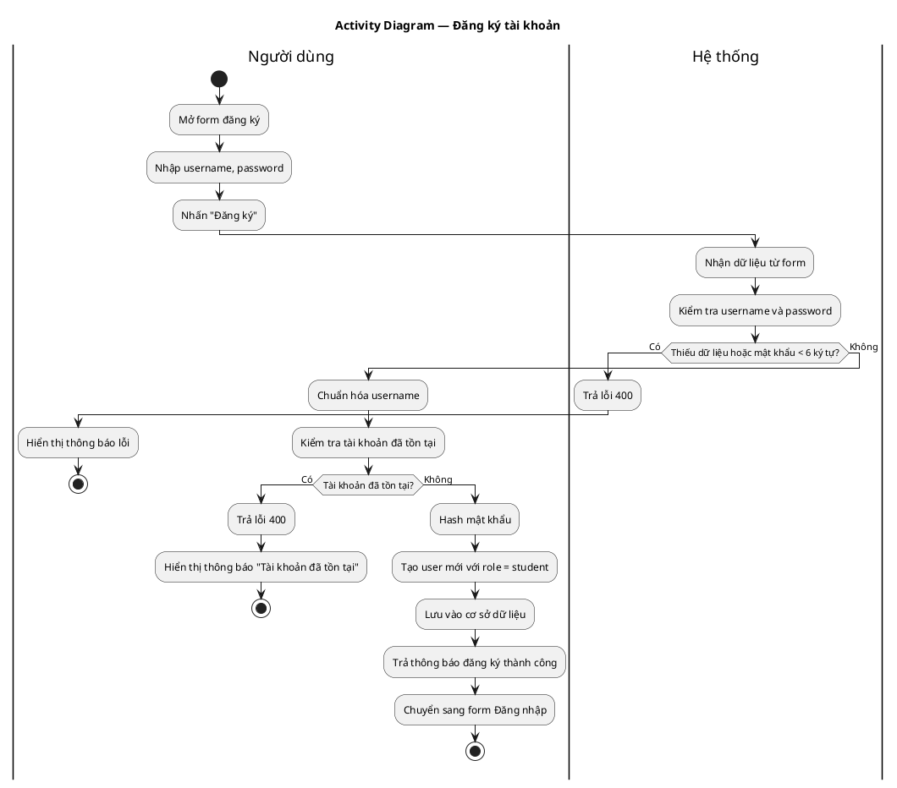
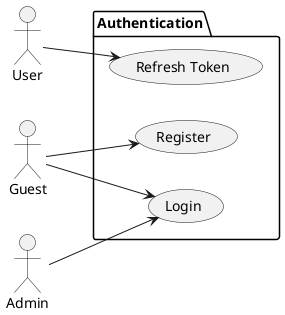
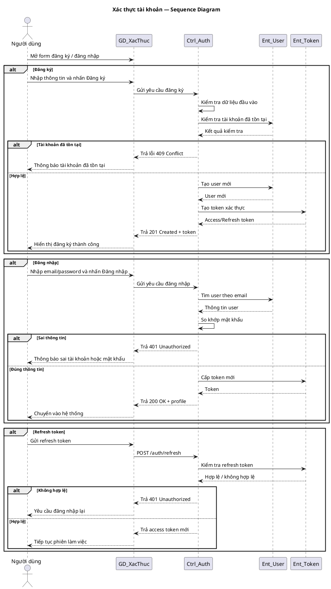

# Use Case Group: Authentication

## Overview
This group covers authentication flows: Register, Login and Refresh Token.

### Actors
- Guest
- User (client)

### Use Cases Included
- Register (create account)
- Login (authenticate)
- Refresh Token (renew access)

### Preconditions
- For Register: guest has required registration data.
- For Login/Refresh: account exists and client has valid credentials/refresh token.

### Main Scenarios
- Register: `POST /register` → validate input → create user → return success (optionally tokens).
- Login: `POST /login` → verify credentials → issue access and refresh tokens → return tokens + profile.
- Refresh: `POST /auth/refresh` → verify refresh token → issue new access token.

### Alternative Flows
- Invalid input → `400 Bad Request`.
- Duplicate account → `409 Conflict`.
- Wrong credentials → `401 Unauthorized`.
- Expired/invalid refresh → `401 Unauthorized`.

### Implementation References
- Routes: [backend/routes/authRoutes.js](backend/routes/authRoutes.js#L1-L20)
- Controller: `backend/controllers/authController.js`

## Activity Diagram — Đăng ký tài khoản

Sao chép block dưới đây vào PlantUML hoặc công cụ hỗ trợ PlantUML trong StarUML để dựng activity diagram theo đúng luồng của code hiện tại.

## Server/Database Flow
- Read operations (e.g. token verification): Client -> Server verifies token/credentials -> Server checks token store or database as needed -> Server returns `200` or `401`.
- Mutating operations (Register/Login): Client -> Server validates input -> Server creates or looks up user records in database -> Server issues tokens and returns `201`/`200` or error codes (`400`/`409`/`401`).
- All authentication changes go through the server layer (controllers/middleware) which is responsible for validation, hashing, storing credentials, and issuing tokens; clients never write directly to the database.

## PlantUML — Usecase Diagram
Sao chép block bên dưới vào PlantUML để vẽ sơ đồ usecase cho Authentication.

## Sequence Diagram — Xác thực (PlantUML)

