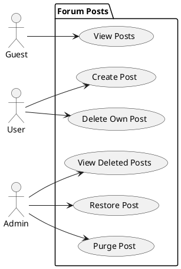
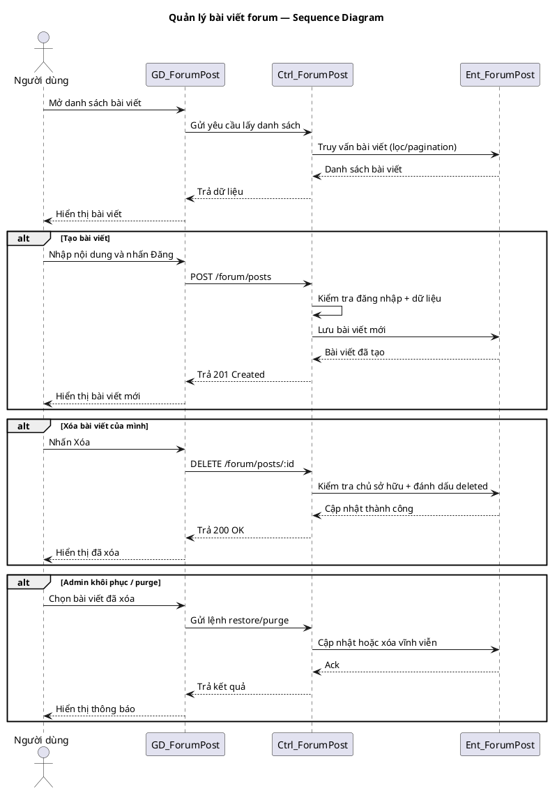

# Use Case Group: Forum Posts

## Overview
CRUD and moderation actions for forum posts: view, create, update (if implemented), delete (soft), restore, and purge.

### Actors
- Guest
- User (active)
- Admin

### Use Cases Included
- View Forum Posts
- Create Forum Post
- Delete Own Post (soft-delete)
- Get Deleted Posts (admin)
- Restore Deleted Post
- Permanently Delete (Purge)

### Preconditions
- Viewing: none.
- Creating/Deleting: user must be active and authenticated.
- Admin actions require admin role.

### Main Success Scenario (combined)
1. View: Client `GET /forum/posts` → Server queries database for posts (filters/pagination) → Server returns `200` with paginated posts.
2. Create: Client `POST /forum/posts` (requireActiveUser) → Server validates payload and authentication → Server inserts new post record into the database → Server returns `201 Created` with the created post resource (or `400` on validation error).
3. Delete (soft): Client `DELETE /forum/posts/:id` (owner) → Server verifies ownership and auth → Server marks the post record as `deleted=true` (soft-delete) in the database → Server returns `200`/`204` confirming deletion (or `403`/`404` on failure).
4. Admin view deleted: Admin `GET /forum/deleted/posts` (requireAdmin) → Server queries database for records with `deleted=true` → Server returns `200` with deleted items list.
5. Restore: Admin `PATCH /forum/posts/:id/restore` (requireAdmin) → Server clears `deleted` flag in the database (or recreates record depending on implementation) → Server returns `200` with restored post (or `404` if missing).
6. Purge: Admin `DELETE /forum/deleted/posts/:id` (requireAdmin) → Server permanently removes the record from the database → Server returns `200`/`204` on success.

Notes:
- All mutating operations follow the same pattern: Client -> HTTP request -> Server validates/authenticates -> Server updates database -> Server responds with appropriate status and resource or error.
- The server may also emit events (webhooks, websockets) to notify clients of changes; this is implementation-specific.

### Alternative Flows
- Not owner → `403 Forbidden` on delete.
- Item not found → `404 Not Found`.

### Implementation References
- Routes: [backend/routes/forumRoutes.js](backend/routes/forumRoutes.js#L1-L80)
- Controller: `backend/controllers/forumController.js`

## PlantUML — Usecase Diagram

## Sequence Diagram — Forum Posts (PlantUML)

