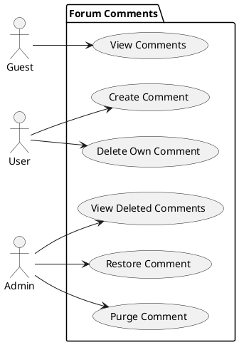
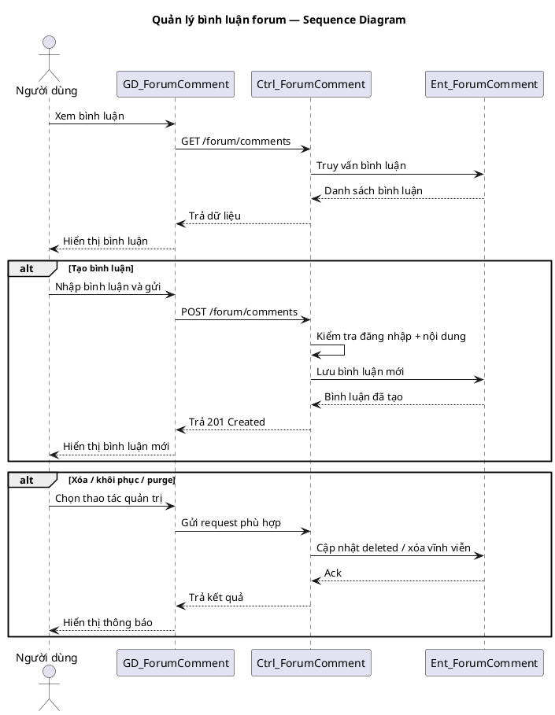

# Use Case Group: Forum Comments

## Overview
Actions for comments: view, create, delete (soft), restore and purge.

### Actors
- Guest
- User (active)
- Admin

### Use Cases Included
- View Forum Comments
- Create Forum Comment
- Delete Own Comment (soft)
- Get Deleted Comments (admin)
- Restore Comment
- Permanently Delete Comment

### Main Success Scenario (combined)
1. View: `GET /forum/comments` → return comments.
2. Create: `POST /forum/comments` (requireActiveUser) → validate and save.
3. Delete: `DELETE /forum/comments/:id` (owner) → soft-delete.
4. Admin: `GET /forum/deleted/comments`, `PATCH /forum/comments/:id/restore`, `DELETE /forum/deleted/comments/:id`.

### Alternative Flows
- Not owner → `403`.
- Missing post/comment → `404`.

### Implementation References
- Routes: [backend/routes/forumRoutes.js](backend/routes/forumRoutes.js#L1-L80)
- Controller: `backend/controllers/forumController.js`

## Server/Database Flow
- Read (view comments): Client `GET` -> Server authenticates/authorizes if required -> Server queries database for comments (with filters/pagination) -> Server returns `200` with data or `404`.
- Create/Delete/Restore/Purge: Client sends HTTP request -> Server validates payload and checks ownership/roles -> Server performs DB write (insert/update `deleted` flag/purge) -> Server returns `201`/`200`/`204` or appropriate error codes.
- Mutating workflows always pass through controller/middleware layers on the server; database is updated only by server-side logic.

## PlantUML — Usecase Diagram

## Sequence Diagram — Forum Comments (PlantUML)

