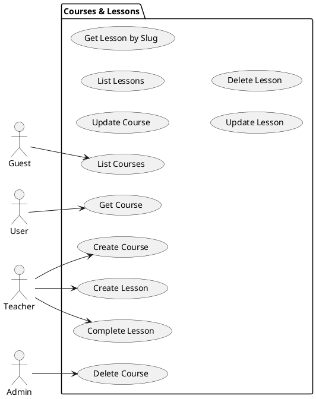
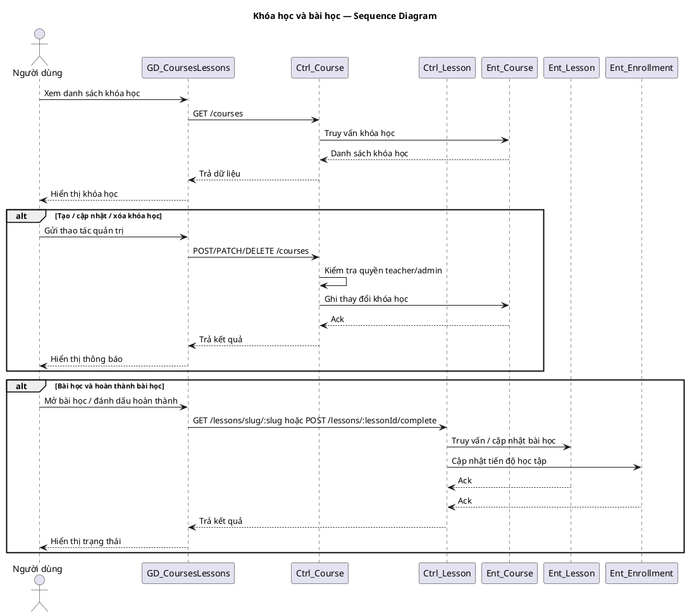

# Use Case Group: Courses & Lessons

## Overview
Course management and lesson operations grouped together: list, get, create, update, delete, lesson retrieval by slug and lesson completion.

### Actors
- Guest
- User (active)
- Teacher
- Admin

### Use Cases Included
- List Courses, Get Course Details, Create/Update/Delete Course
- List Lessons (per course), Create/Update/Delete Lesson, Get Lesson by Slug
- Complete Lesson (marks progress)

### Preconditions
- Creating/updating/deleting courses or lessons require `requireTeacherOrAdmin`.
- Viewing courses/lessons may require authentication for enrolled content.

### Main Success Scenario (combined)
1. Courses: `GET /courses` lists courses; `GET /courses/:courseId` returns details.
2. Teacher/Admin: `POST /courses`, `PATCH /courses/:courseId`, `DELETE /courses/:courseId` manage courses.
3. Lessons: `GET /courses/:courseId/lessons`, `POST /courses/:courseId/lessons`, `PATCH /lessons/:lessonId`, `DELETE /lessons/:lessonId`, `GET /lessons/slug/:slug`.
4. Complete lesson: `POST /lessons/:lessonId/complete` updates enrollment progress.

### Alternative Flows
- Unauthorized → `403` for teacher/admin endpoints.
- Not found → `404`.

### Implementation References
- Routes: [backend/routes/courseRoutes.js](backend/routes/courseRoutes.js#L1-L40), [backend/routes/lessonRoutes.js](backend/routes/lessonRoutes.js#L1-L40)
- Controllers: `backend/controllers/courseController.js`, `backend/controllers/lessonController.js`

## Server/Database Flow
- Viewing (list/get): Client `GET` -> Server checks authentication/authorization when required -> Server queries database for course/lesson records (may join enrollments or visibility rules) -> Server returns `200` with resources or `404`.
- Mutations (create/update/delete/complete): Client sends `POST`/`PATCH`/`DELETE` -> Server validates payload and verifies role/ownership -> Server updates database (insert/update soft-delete/mark completion) -> Server returns `201`/`200`/`204` or error codes (`400`/`401`/`403`/`404`).
- Server-side controllers and middleware enforce access checks; clients never write directly to the database.

## PlantUML — Usecase Diagram

## Sequence Diagram — Courses & Lessons (PlantUML)

