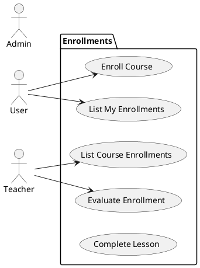
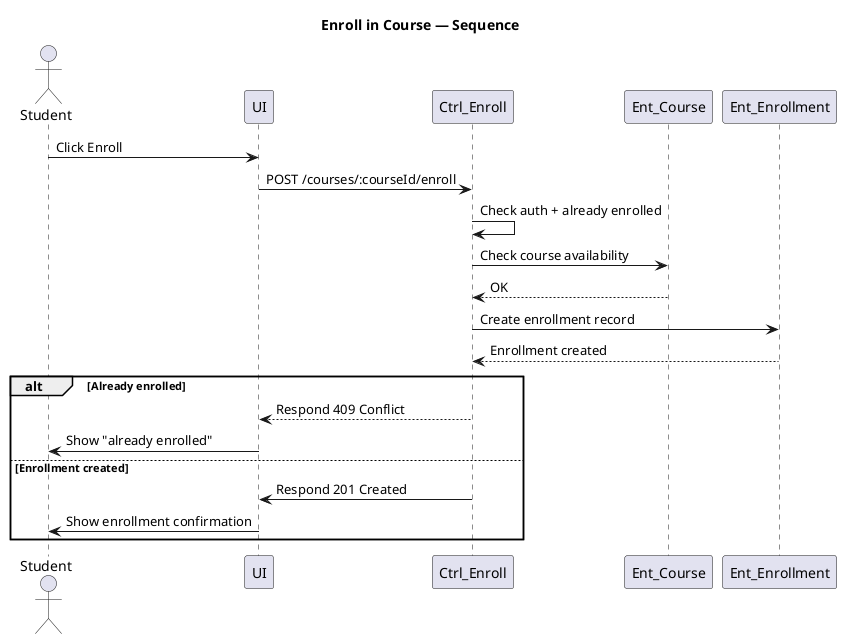

# Use Case Group: Enrollments

## Overview
Student enrollment workflows: enroll to course, view own enrollments, teacher/admin viewing enrollments, lesson completion and evaluation.

### Actors
- User (student)
- Teacher
- Admin

### Use Cases Included
- Enroll in Course, List My Enrollments, List Course Enrollments, Complete Lesson, Evaluate Enrollment

### Main Success Scenario (combined)
1. Enroll: `POST /courses/:courseId/enroll` (requireActiveUser) → create enrollment.
2. List mine: `GET /enrollments/me` returns user's enrollments.
3. Teacher/Admin: `GET /courses/:courseId/enrollments` returns enrollments for course.
4. Complete lesson: `POST /lessons/:lessonId/complete` marks progress.
5. Evaluate: `PATCH /enrollments/:enrollmentId/evaluate` allows teacher/admin to grade.

### Alternative Flows
- Already enrolled → return existing or conflict.
- Unauthorized → `403`.

### Implementation References
- Routes: [backend/routes/enrollmentRoutes.js](backend/routes/enrollmentRoutes.js#L1-L40)
- Controller: `backend/controllers/enrollmentController.js`

## Server/Database Flow
- Enroll/List/Complete/Evaluate flows: Client sends request -> Server validates authentication and business rules (e.g., already enrolled, course capacity) -> Server creates/updates enrollment records in database or queries them -> Server returns `201`/`200`/`204` or appropriate error codes.
- All enrollment state changes are performed by the server layer; clients only send HTTP requests and receive responses.

## PlantUML — Usecase Diagram + Sequence (Enroll)
Usecase:

Sequence (Enroll):

