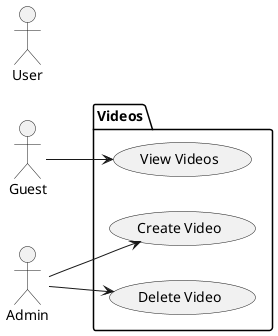
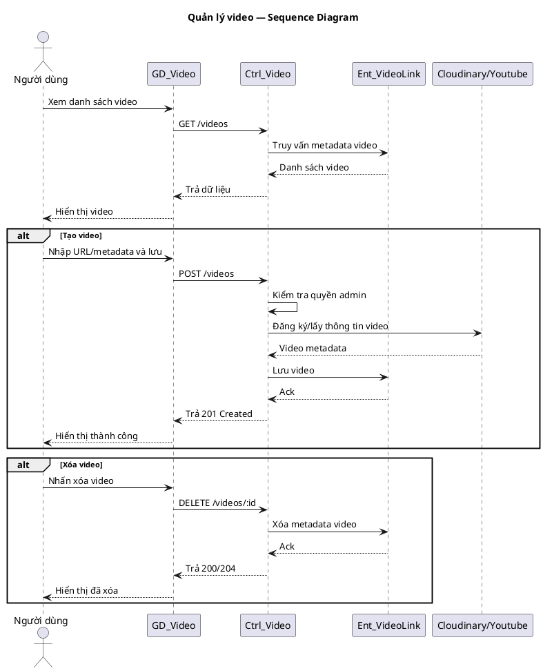

# Use Case Group: Videos

## Overview
Video listing and admin video management (create/delete).

### Actors
- Guest
- User
- Admin

### Use Cases Included
- View Videos, Create Video, Delete Video

### Main Success Scenario (combined)
1. View: `GET /videos` returns list of videos.
2. Admin: `POST /videos` to create metadata; `DELETE /videos/:id` to remove.

### Alternative Flows
- Unauthorized → `403` for admin actions.
- Not found → `404`.

### Implementation References
- Routes: [backend/routes/videoRoutes.js](backend/routes/videoRoutes.js#L1-L30)
- Controller: `backend/controllers/videoController.js`

## Server/Database Flow
- View: Client `GET /videos` -> Server queries database or media service for video metadata -> Server returns `200` with list/details.
- Create/Delete: Client `POST`/`DELETE` -> Server validates permissions and input -> Server stores metadata in database and media in cloud if applicable -> Server returns `201`/`200`/`204` or errors.
- Video storage often involves both database records and external media storage (Cloudinary/Youtube); server coordinates both systems.

## PlantUML — Usecase Diagram

## Sequence Diagram — Videos (PlantUML)

