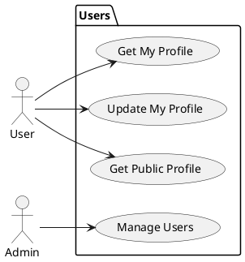

# Use Case Diagram: Users

Sao chép block PlantUML bên dưới vào PlantUML để vẽ sơ đồ usecase cho Users.

```plantuml
@startuml
left to right direction
actor "User" as User
actor "Admin" as Admin

package "Users" {
  usecase "Get My Profile" as UC_GetMyProfile
  usecase "Update My Profile" as UC_UpdateMyProfile
  usecase "Get Public Profile" as UC_GetPublicProfile
  usecase "Manage Users" as UC_ManageUsers
}

User --> UC_GetMyProfile
User --> UC_UpdateMyProfile
User --> UC_GetPublicProfile
Admin --> UC_ManageUsers

@enduml
```
