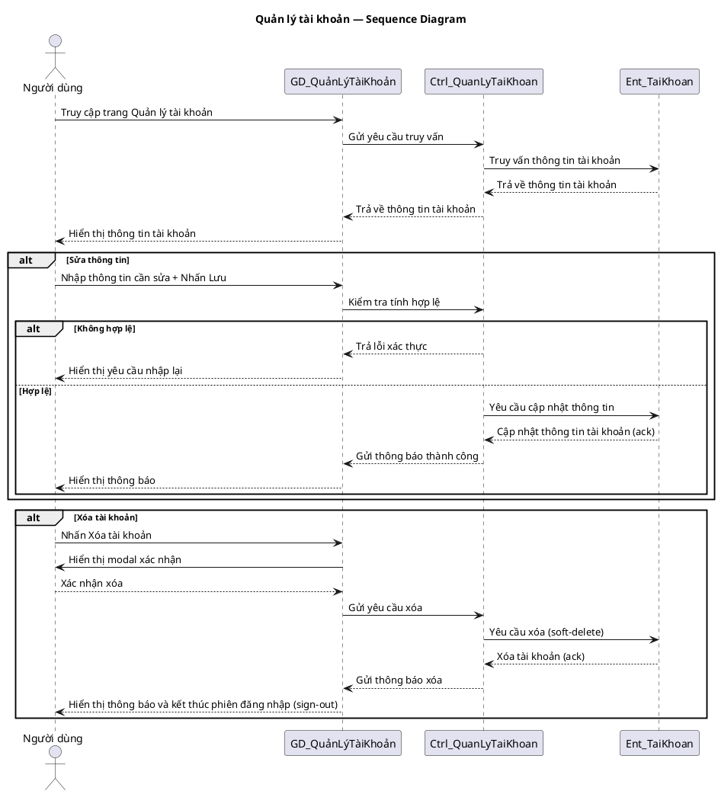

# Use Case Group: Users

## Overview
Admin user management and personal profile flows for users.

### Actors
- Admin
- User

### Use Cases Included
- Manage Users (list/create/update role/status/delete)
- Get My Profile, Update My Profile
- Get Public Profile

### Main Success Scenario (combined)
1. Admin endpoints: `GET /users`, `POST /users`, `PATCH /users/role`, `PATCH /users/status`, `DELETE /users/:username`.
2. User endpoints: `GET /users/me/profile`, `PATCH /users/me/profile`, `GET /users/:userId/profile`.

### Alternative Flows
- Unauthorized access → `403`.
- Not found → `404`.

### Implementation References
- Routes: [backend/routes/userRoutes.js](backend/routes/userRoutes.js#L1-L40)
- Controller: `backend/controllers/userController.js`

## Server/Database Flow
- Read (profiles, user lists): Client `GET` -> Server checks auth/roles -> Server queries users collection/table -> Server returns `200` with requested data or `404`.
- Mutations (create user, update profile, change role/status, delete): Client sends `POST`/`PATCH`/`DELETE` -> Server validates payload and authorization (admin checks or ownership) -> Server updates user record in database (create/update/soft-delete) -> Server returns `201`/`200`/`204` or appropriate error codes.
- Sensitive operations (password, role changes) should be handled by server-side controllers and not exposed to direct DB writes.

## Sequence Diagram — Quản lý tài khoản (PlantUML)

Sao chép toàn bộ block dưới đây vào PlantUML để vẽ sơ đồ tuần tự giống mẫu bạn gửi.

