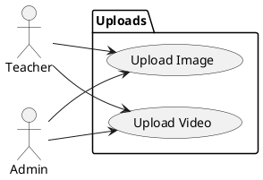
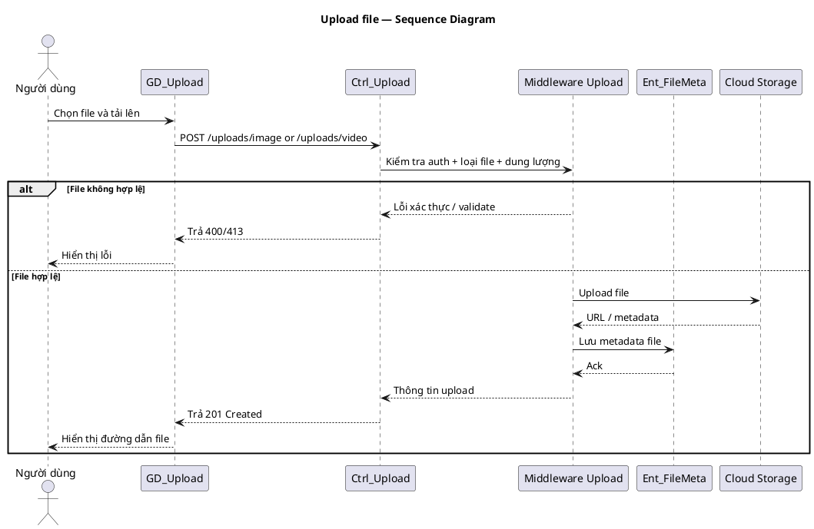

# Use Case Group: Uploads

## Overview
File upload flows for images and videos using middleware and controllers.

### Actors
- Teacher
- Admin

### Use Cases Included
- Upload Image, Upload Video

### Main Success Scenario (combined)
1. Image: `POST /uploads/image` with multipart/form-data field `image` → middleware `imageUpload` → controller `uploadImage` saves file to cloud and returns URL.
2. Video: `POST /uploads/video` with field `video` → middleware `videoUpload` → controller `uploadVideo` saves and returns metadata/URL.

### Alternative Flows
- File too large/invalid format → `400` with error message.
- Unauthorized → `403`.

### Implementation References
- Routes: [backend/routes/uploadRoutes.js](backend/routes/uploadRoutes.js#L1-L80)
- Middleware: `backend/middleware/upload.js`
- Controller: `backend/controllers/uploadController.js`

## Server/Database Flow
- Uploads: Client `POST /uploads/...` -> Server middleware validates file and auth -> Server stores file in external storage (cloud) and writes metadata/URL to database -> Server returns `201` with file metadata or `400`/`413` on error.
- Deletions: Client `DELETE` -> Server validates permissions -> Server removes metadata from database and may remove file from storage -> Server returns `200`/`204`.

## PlantUML — Usecase Diagram

## Sequence Diagram — Uploads (PlantUML)

