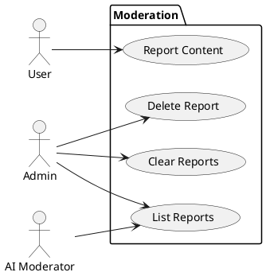
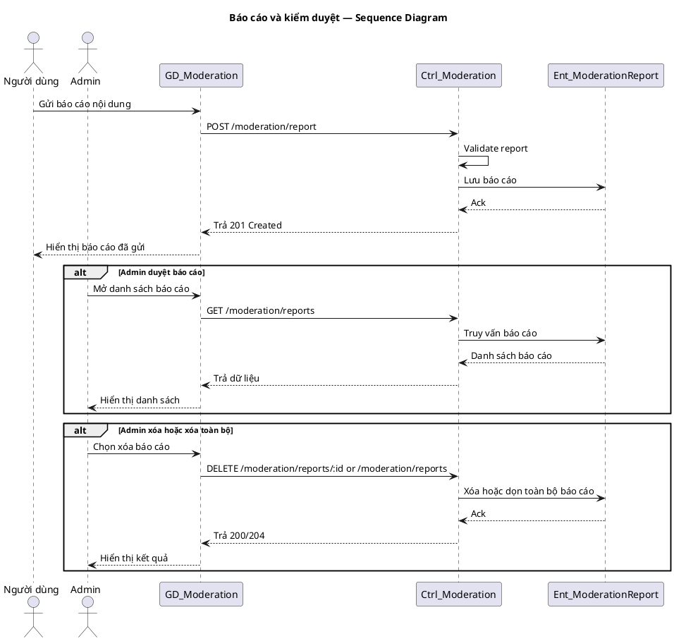

# Use Case Group: Moderation

## Overview
Reporting and report management flows: create report, list/review reports, delete/clear reports.

### Actors
- User
- Admin
- AI Moderator (system)

### Use Cases Included
- Report Content, List/Review Reports, Delete/Clear Reports

### Main Success Scenario (combined)
1. User files report: `POST /moderation/report` → store `ModerationReport`.
2. Admin lists reports: `GET /moderation/reports` → review.
3. Admin deletes single report: `DELETE /moderation/reports/:id` or clears all: `DELETE /moderation/reports`.

### Alternative Flows
- Unauthorized → `403` for admin endpoints.
- Not found → `404`.

### Implementation References
- Routes: [backend/routes/moderationRoutes.js](backend/routes/moderationRoutes.js#L1-L40)
- Controller: `backend/controllers/moderationController.js`

## Server/Database Flow
- Reporting: Client `POST /moderation/report` -> Server validates and stores report record in database -> Server returns `201`.
- Admin review actions: Client `GET`/`PATCH`/`DELETE` -> Server checks admin auth -> Server queries or updates moderation records in database -> Server returns `200`/`204` accordingly.
- Automated moderation (AI) may create or flag reports via server-side services that insert records into the database.

## PlantUML — Usecase Diagram

## Sequence Diagram — Moderation (PlantUML)

