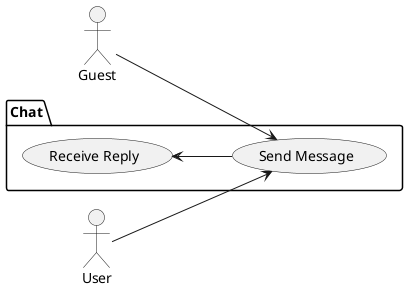
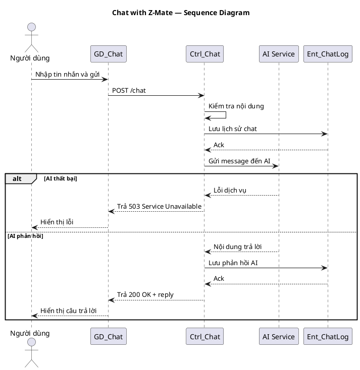

# Use Case: Chat with Z-Mate

## Overview
Chat endpoint for interacting with an AI agent (Z-Mate).

### Actors
- Guest
- User

### Main Scenario
1. Client posts message to `POST /chat`.
2. Server forwards to AI/chat service and returns reply.

### Alternatives
- AI service failure → `503 Service Unavailable`.

### Implementation References
- Routes: [backend/routes/chatRoutes.js](backend/routes/chatRoutes.js#L1-L20)
- Controller: `backend/controllers/chatController.js`

## Server/Database Flow
- Send message: Client `POST /chat` -> Server validates input and may log message -> Server forwards message to AI/chat service and persists chat history to database if configured -> Server returns AI reply (`200`) or `503` on external service failure.
- Chat logs and transcripts are stored by server-side code; clients never write directly to the database or AI service endpoints.

## PlantUML — Usecase Diagram

## Sequence Diagram — Chat (PlantUML)

