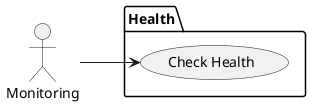
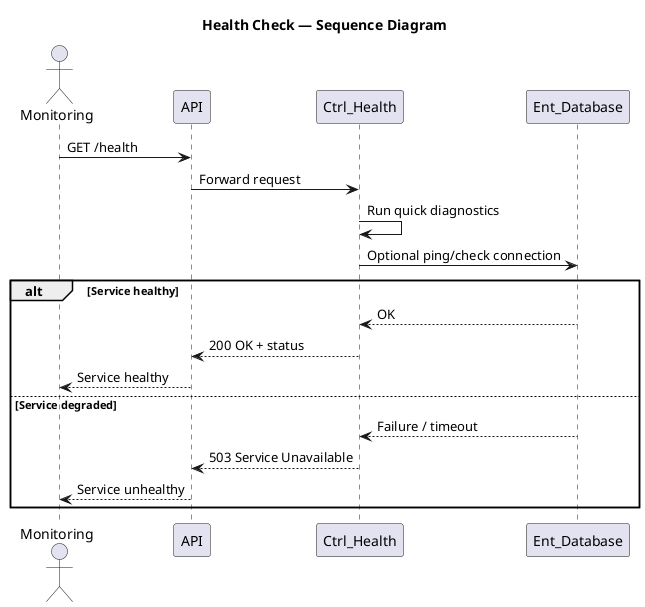

# Use Case: Health Check

## Overview
System health endpoint for monitoring and service checks.

### Actor
- Monitoring / System

### Main Scenario
1. GET `/health` returns service status and basic diagnostics.

### Implementation References
- Routes: [backend/routes/healthRoutes.js](backend/routes/healthRoutes.js#L1-L20)
- Controller: `backend/controllers/healthController.js`

## Server/Database Flow
- Health check: Client (monitor) `GET /health` -> Server runs quick diagnostics and may query database/connected services -> Server returns `200` with status details or `503` if critical services are down.
- Health endpoints are read-only and always served by server logic; database/state checks are performed by the server before responding.

## PlantUML — Usecase Diagram

## Sequence Diagram — Health Check (PlantUML)

