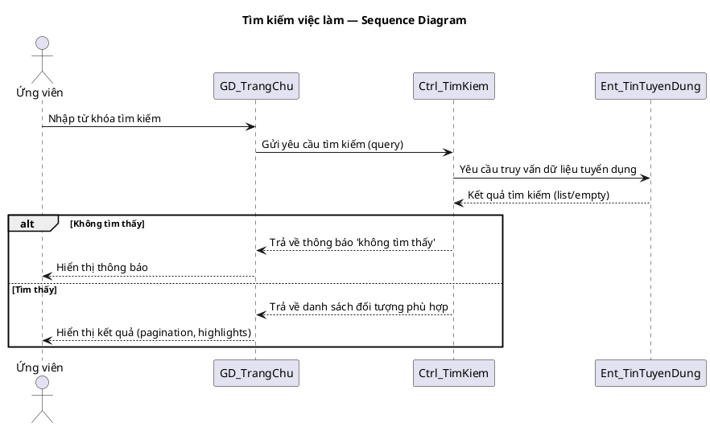

# Use Case: Tìm kiếm việc làm

Mô tả: Sequence diagram cho luồng Tìm kiếm việc làm (found / not found). Sao chép block PlantUML vào PlantUML editor để vẽ.

```plantuml
@startuml
title Tìm kiếm việc làm — Sequence Diagram
actor "Ứng viên" as Candidate
participant "GD_TrangChu" as UI
participant "Ctrl_TimKiem" as Ctrl
participant "Ent_TinTuyenDung" as Ent

Candidate -> UI: Nhập từ khóa tìm kiếm
UI -> Ctrl: Gửi yêu cầu tìm kiếm (query)
Ctrl -> Ent: Yêu cầu truy vấn dữ liệu tuyển dụng
Ent --> Ctrl: Kết quả tìm kiếm (list/empty)
alt Không tìm thấy
  Ctrl --> UI: Trả về thông báo 'không tìm thấy'
  UI --> Candidate: Hiển thị thông báo
else Tìm thấy
  Ctrl --> UI: Trả về danh sách đối tượng phù hợp
  UI --> Candidate: Hiển thị kết quả (pagination, highlights)
end
@enduml
```
